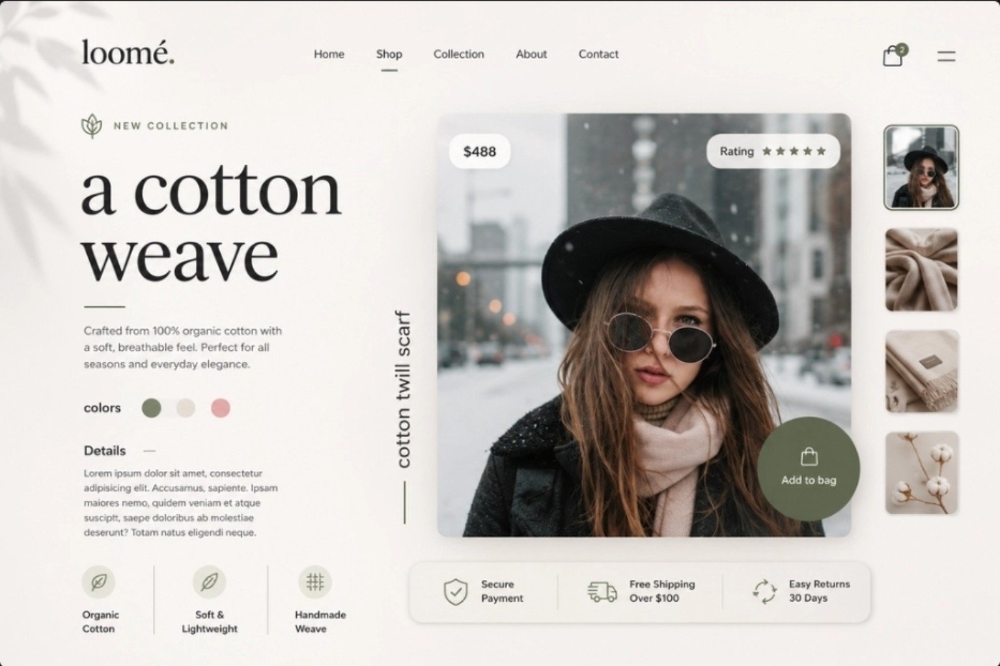

# 🚀 A1 Assignment - Cohort 3.0

This repository contains the successful completion of **Task 1 - A1 Assignment** provided in the **Cohort 3.0 Batch**.

The project was built as part of my learning journey to strengthen frontend development fundamentals and improve practical implementation skills.

## 📌 About The Assignment

The objective of this assignment was to recreate the provided UI design accurately using web development technologies while maintaining proper structure and clean code practices.

This assignment marks the restart of my developer journey — going from **basics to advanced development** with consistency, discipline, and real project building.

## 🛠️ Tech Stack Used

- HTML5
- CSS3

## 🎯 Goals Achieved

- Completed the assigned UI successfully
- Practiced frontend structure and styling
- Improved layout understanding
- Focused on clean and organized code
- Uploaded and maintained the project on GitHub

## 📷 Task Preview

Below is the preview image of the assignment task that was recreated successfully.

